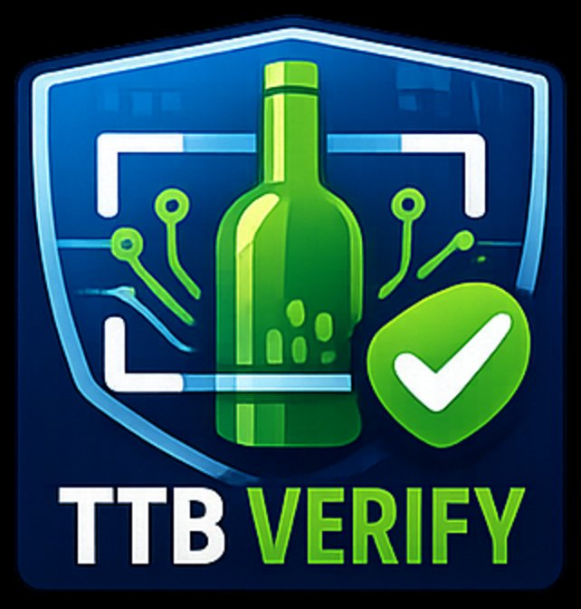

<p align="center">
  
</p>

# TTB Verify

An AI-assisted label verification tool for the Alcohol and Tobacco Tax and Trade Bureau (TTB) Compliance Division. TTB Verify helps compliance agents check whether an alcohol beverage label matches the information submitted in a Certificate of Label Approval (COLA) application — and whether the label meets TTB's mandatory regulatory requirements.

---

## Background

### What is TTB?

The Alcohol and Tobacco Tax and Trade Bureau (TTB) is a bureau of the U.S. Department of the Treasury. TTB is responsible for enforcing federal laws covering the production, importation, wholesale distribution, and labeling of alcohol beverages sold in the United States. Its mission includes protecting consumers by ensuring that alcohol beverage labels are accurate, truthful, and compliant with federal regulations.

### What is a COLA?

Before an alcohol beverage can be sold in the United States, the producer or importer must obtain a **Certificate of Label Approval (COLA)** from TTB. A COLA certifies that the label on a product has been reviewed and approved as compliant with federal labeling requirements under the Federal Alcohol Administration Act (FAA Act).

Producers submit COLA applications through TTB's online system (COLAs Online) containing product information such as brand name, class and type, alcohol content, net contents, producer name and address, and country of origin. TTB compliance agents then review the physical label to verify that what appears on the bottle matches what was submitted in the application.

### What regulations govern alcohol beverage labels?

TTB's labeling regulations are codified in the Code of Federal Regulations (CFR):

- **27 CFR Part 4** — Wine labeling
- **27 CFR Part 5** — Distilled spirits labeling
- **27 CFR Part 7** — Malt beverage labeling
- **27 CFR Part 16** — Mandatory government warning statement

These regulations specify which fields must appear on a label, what format they must take, and what language is required. For example, every alcohol beverage containing 0.5% or more alcohol by volume must carry the exact government warning statement specified in 27 CFR Part 16, Section 16.21.

### Why this tool?

Manually comparing label images against COLA application data is time-consuming and error-prone. This tool uses AI vision to read a label photograph, extract the regulated fields, and automatically compare them against the application — flagging mismatches, formatting issues, and missing required elements for agent review. It does not replace agent judgment; it surfaces discrepancies and lets agents record and finalize their decisions.

---

## How to Use the Tool

### Accessing the tool

Open the tool in your web browser. No login is required for the prototype. The tool works on desktop and mobile.

---

### Verifying a Single Label

This is the primary workflow for reviewing an individual COLA application.

**Step 1 — Select beverage type**

At the top of the page, select the beverage type: **Distilled Spirits**, **Wine**, or **Malt Beverage / Beer**. This determines which regulatory rules apply during verification.

**Step 2 — Upload the front label**

Click or drag a photo of the front label into the **Front Label** upload area. Accepted formats: JPEG, PNG, WebP. Maximum file size: 5 MB.

As soon as the image is uploaded, the tool reads the label using AI and automatically populates the **Extracted Fields** form below with values found on the label. This typically takes 2–4 seconds.

> **Image quality tips:** Use a well-lit, straight-on photo with no glare. Avoid extreme angles. If the tool flags image quality issues, those will appear in a yellow warning banner — review any fields marked "verify carefully" manually.

**Step 3 — Upload the back label (recommended)**

Click or drag a photo of the back label into the **Back Label** upload area. The back label typically contains the government warning statement, producer address, and net contents. Uploading both labels gives the tool more to work with and improves extraction accuracy.

After uploading the back label, the fields will update automatically, merging the best-confidence values from both images.

**Step 4 — Review and correct extracted fields**

Before verifying, review each field in the **Extracted Fields** section. The colored dot next to each field label indicates the AI's confidence in that extraction:

- 🟢 **Green** — High confidence. Value is clearly readable.
- 🟡 **Amber** — Medium confidence. Value is readable but may be stylized, small, or partially obscured. Verify manually.
- 🔴 **Red** — Low confidence. Value is difficult to read. Verify carefully before proceeding.

If a field value is wrong, click into the field and correct it. The tool will use whatever values are in the form when you hit Verify — so what you see is what gets checked.

**Country of Origin** is inferred automatically as **USA** if the producer address contains a U.S. state name or abbreviation (e.g., "Frankfort, Kentucky"). Correct this if the product is imported.

**Step 5 — Verify the label**

Click **Verify Label**. The tool compares each field against the COLA application data and checks the government warning statement against the required statutory text.

Results appear immediately with an overall status:

- ✅ **Approved** — All fields match the application and meet regulatory requirements.
- ⚠️ **Needs Review** — One or more fields have discrepancies or low-confidence reads that require agent review.
- ❌ **Rejected** — One or more fields do not match the application or fail a regulatory requirement.

**Step 6 — Review field results**

Each field shows:

- **Application value** — what was submitted in the COLA application
- **Label value** — what the tool read from the label
- **Status badge** — Pass, Fail, or Review
- **Note** — explanation of the result

Fields that fail or need review include an **agent decision** section. Click **Record agent decision**, select **Accept** or **Reject**, enter a reason, and click **Save decision**. The overall status updates automatically as you work through each flagged field.

> **Note on casing:** TTB regulations do not restrict whether label body text appears in uppercase or mixed case. A label reading "KENTUCKY STRAIGHT BOURBON WHISKEY" will match an application reading "Kentucky Straight Bourbon Whiskey." The tool handles this automatically.

**Step 7 — Finalize**

Once all flagged fields have an agent decision recorded, **Finalize: Approve** and **Finalize: Reject** buttons appear in the status banner. Click the appropriate button to lock in the final decision.

To start over with a new label, click **← Verify another label** at the top of the results page.

---

### Batch Verification

The **Batch** tab allows multiple labels to be uploaded and verified at once — useful for processing a queue of COLA applications.

**Step 1 — Switch to the Batch tab**

Click **Batch** at the top of the page.

**Step 2 — Upload label images**

Upload multiple label image files at once by clicking the upload area or dragging files in. Each file should be named or organized so you can match results back to the correct application.

**Step 3 — Review results**

The tool processes labels in parallel and displays results as they complete. Each label shows its overall status. Labels that fail or return errors are called out clearly so they can be prioritized for manual review.

> **Batch limit:** Up to 300 labels per batch.

---

## Understanding Verification Results

### Field statuses

| Status | Meaning |
|---|---|
| **Pass** | Field on label matches the application value. |
| **Fail** | Field does not match, is missing, or fails a regulatory requirement. |
| **Review** | Values are close but differ in spacing, or the AI confidence is low. Agent should confirm manually. |
| **Not Checked** | Field was not validated (e.g., ABV on a wine labeled "Table Wine" under 14% is optional). |

### Government warning statement

The government warning statement is validated against the exact statutory text required by 27 CFR Part 16, Section 16.21. The full required text is:

> GOVERNMENT WARNING: (1) According to the Surgeon General, women should not drink alcoholic beverages during pregnancy because of the risk of birth defects. (2) Consumption of alcoholic beverages impairs your ability to drive a car or operate machinery, and may cause health problems.

The prefix **GOVERNMENT WARNING:** must appear in all caps. The body text may appear in all caps or mixed case — both are permitted. The tool validates the text content; agents should visually confirm that "GOVERNMENT WARNING:" appears in bold on the physical label, as required by regulation.

### Confidence indicators

The colored dots and confidence labels reflect how clearly the AI was able to read each field from the image — not whether the field passes or fails. A high-confidence fail means the tool clearly read a value that doesn't match. A low-confidence pass means the value matched but the image was difficult to read and manual confirmation is recommended.

### Image quality warnings

If the tool detects degraded image quality (glare, angle, curvature, shadows), a yellow warning banner appears listing the specific issues. Fields affected by image quality are flagged for manual verification. Submitting a clearer photo will improve extraction accuracy.

---

## Regulatory Reference

### Fields validated

| Field | Regulation |
|---|---|
| Brand Name | 27 CFR 5.32, 4.32, 7.22 |
| Class / Type | 27 CFR 5.35, 4.34, 7.24 |
| Alcohol Content (ABV) | 27 CFR 5.32(d), 4.36, 7.65 |
| Net Contents | 27 CFR 5.38, 4.37, 7.70 |
| Producer / Bottler Name | 27 CFR 5.36, 4.35, 7.26 |
| Producer / Bottler Address | 27 CFR 5.36, 4.35, 7.26 |
| Country of Origin | 27 CFR 5.36(a) (imports) |
| Government Warning Statement | 27 CFR Part 16, §16.21 |

### ABV tolerances

The tool allows the following tolerances when comparing stated ABV against the label:

- Distilled spirits: ±0.3% (27 CFR 5.65)
- Malt beverages: ±0.3% (27 CFR 7.65)
- Wine under 14% ABV: ±1.5% (27 CFR 4.36)
- Wine over 14% ABV: ±1.0% (27 CFR 4.36)

Values within tolerance are flagged for review rather than automatic rejection.

### Wine ABV exceptions

- Wine under 7% ABV is outside TTB jurisdiction (regulated by FDA). The tool skips ABV validation and flags it for agent awareness.
- Wine between 7–14% ABV labeled "Table Wine" or "Light Wine": ABV statement is optional per 27 CFR 4.36(a).
- Wine over 14% ABV: ABV statement is mandatory.

### Allergen labeling

TTB published proposed rulemaking in January 2025 (Notice No. 232) that would require allergen disclosures on alcohol beverage labels. As of April 2026, this rule has **not been finalized**. The tool does not currently enforce allergen labeling. Monitor [ttb.gov](https://www.ttb.gov) for updates.

---

## Security and Privacy

No label images or application data are stored by this tool. All processing happens in memory and is discarded when the session ends. Images are transmitted securely to Anthropic's AI service for reading and are not retained. No personally identifiable information is logged.

This is a prototype. A production deployment for federal use would require FedRAMP-authorized hosting, a formal Authority to Operate (ATO), role-based access controls, and integration with TTB's audit logging infrastructure.

---

## Technical Setup (for developers)

### Prerequisites

- Node.js 18+
- An Anthropic API key ([console.anthropic.com](https://console.anthropic.com))

### Install and run locally

```bash
git clone <repo-url>
cd ttb-label-verify
npm install
cp .env.example .env.local
# Add your ANTHROPIC_API_KEY to .env.local
npm run dev
```

Open [http://localhost:3000](http://localhost:3000).

### Deploy to Vercel

1. Push this repo to GitHub
2. Import at [vercel.com/new](https://vercel.com/new)
3. Add `ANTHROPIC_API_KEY` under **Settings → Environment Variables**
4. Deploy

> Vercel hobby plan has a 10s serverless function timeout. Extraction targets 2–4s. Upgrade to Vercel Pro for no cold starts and a 60s timeout if needed.

### Architecture

```
/lib/extraction/labelExtractor.ts  Claude Vision API call (server-side only)
/lib/validation/fieldValidator.ts  Pure validation logic — no AI, fully testable
/lib/constants/warnings.ts         Regulatory constants (CFR refs, ABV patterns)
/app/api/extract/route.ts          POST — extracts fields from image
/app/api/verify/route.ts           POST — validates extracted data against application
/app/api/verify/batch/route.ts     POST — batch verification (up to 300 labels)
/components/VerificationResult.tsx Field-by-field results with override controls
/app/page.tsx                      Main page and state orchestration
```

Extraction uses `claude-haiku-4-5` for speed. Verification runs locally in TypeScript with no AI call — ensuring the validation logic is deterministic, auditable, and fast.
